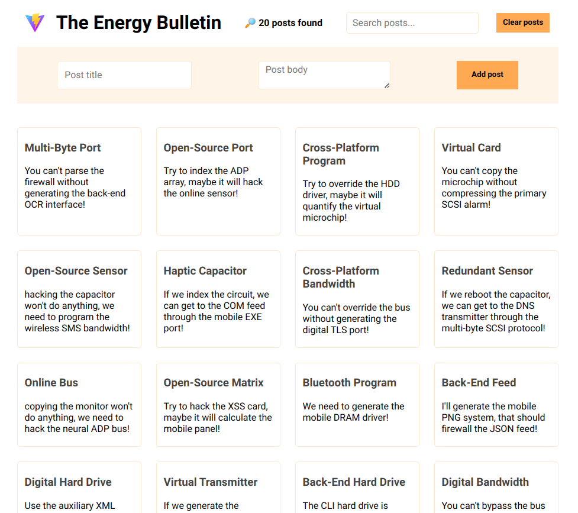
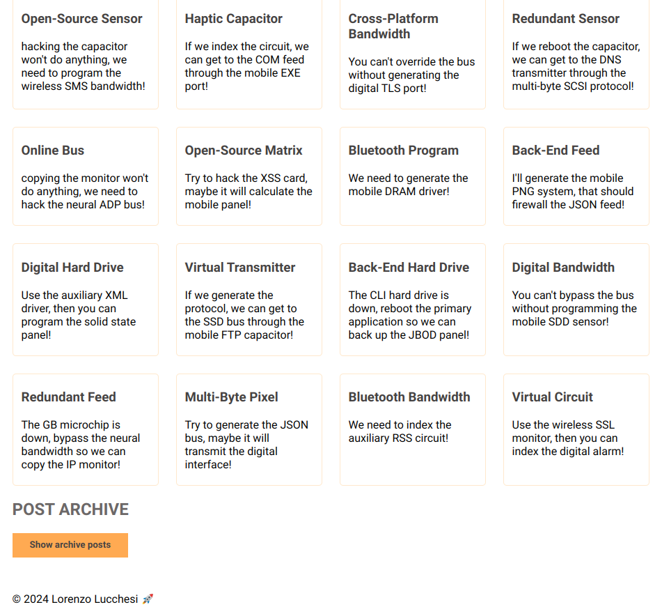
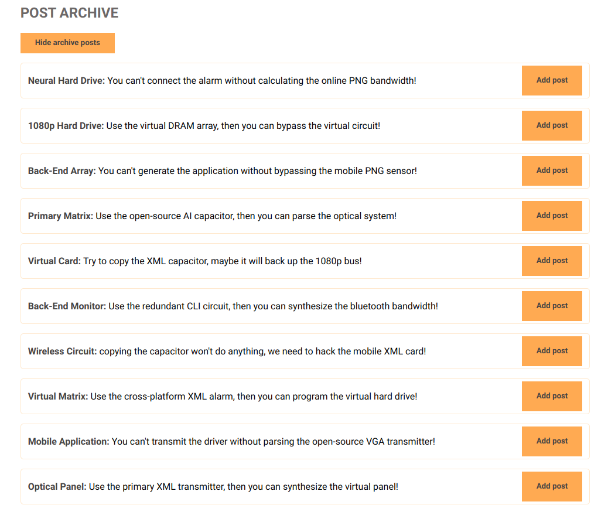

# The Energy Bulletin

This project is a simple post manager developed with React. It uses context and hooks to manage posts, including adding new posts, filtering posts based on a search query, and clearing all posts. The project ensures that only unique posts are added to the list.

## Features

- Add new posts with a unique title.
- Filter posts based on a search query.
- Clear all posts with a confirmation prompt.
- Manage post state using React Context and hooks.
- Generate random posts using the `@faker-js/faker` library.

## Screenshots







## Installation

1. Clone the repository:

   ```bash
   git clone https://github.com/lucchesilorenzo/the-energy-bulletin.git
   cd the-energy-bulletin
   ```

2. Install dependencies:

   ```bash
   npm install
   ```

3. Start the development server:
   ```bash
   npm run dev
   ```
